# Version 1.1 Frontend Refactor – Final Architecture Report

This report summarizes the outcomes of the Version 1.1 Frontend Refactoring process. The refactoring effort transformed a legacy codebase into a modular, clean, and type-safe frontend architecture, guided by six Architectural Decision Records (ADRs).

---

## 1. Architectural Evolution

Below is the conceptual architecture comparison between the legacy setup and the newly established structure:

```mermaid
graph TD
    subgraph Legacy Architecture
        L1[Global Style style.css] --> L2[Coupled DOM Pages index.html]
        L2 --> L3[Direct Store Access store.ts]
        L3 --> L4[Implicit API Actions api.ts]
    end

    subgraph Refactored V1.1 Architecture
        R1[Style Layer: Core / Layout / Components / Pages] --> R2[DOM Component Layer: Lifecycle Managed]
        R2 --> R3[State Layer: Minimal Global Store / Local Fetching]
        R2 --> R4[Service Layer: Typed API Service / Central Errors]
        R2 --> R5[Utility Layer: Pure Stateless Helpers / Config / Constants]
    end
    
    style Legacy Architecture fill:#2d1f1f,stroke:#ff4757,stroke-width:2px;
    style Refactored V1.1 Architecture fill:#1e272e,stroke:#2ed573,stroke-width:2px;
```

---

## 2. Phase-by-Phase Retrospective

Here is a summary of the accomplishments throughout each phase of the refactoring roadmap:

| Phase | Component Area | Core Objectives & Accomplishments |
| :--- | :--- | :--- |
| **Phase 0** | Baseline Verification | Established test suites, confirmed initial frontend functionality, and setup the local mock system. |
| **Phase 1** | CSS Refactor Setup | Audited existing CSS rules, defined modular directory structures, and planned naming conventions. |
| **Phase 2** | CSS Core extraction | Extracted layout and visual variables into `variables.css`, `reset.css`, and global `utilities.css`. |
| **Phase 3** | CSS Layout extraction | Decoupled app shell layout structures into `shell.css`, `sidebar.css`, and `topbar.css`. |
| **Phase 4** | CSS Foundational UI | Modularized visual rules for baseline components (`buttons.css`, `forms.css`, `cards.css`, `toast.css`, `tables.css`, `badges.css`). |
| **Phase 5** | CSS Complex UI | Extracted styles for overlays and dashboard elements into `modals.css` and `widgets.css`. |
| **Phase 6** | CSS Page styles | Modularized page-specific styling for the login screen, dashboard, and ticket detail views. |
| **Phase 7** | DOM Utilities | Replaced fragile `innerHTML`-based rendering with pure, declarative DOM builder utils in `dom.ts`. |
| **Phase 8** | DOM Component Lifecycle | Refactored complex modal dialogs (`EditTicketModal.ts` and `TicketDetailModal.ts`) into lifecycle-driven classes. |
| **Phase 9** | Service Layer | Standardized API services, unified return payloads, and introduced the global `APIError` handler. |
| **Phase 10** | State Management | Reduced global state dependencies to only routing and user auth; forced components to fetch fresh local data. |
| **Phase 11** | Utilities & Helpers | Centralized configs (`config.ts`), enumerations (`enums.ts`), and constants (`constants.ts`), cleaning up formatting utilities. |
| **Phase 12** | Dead Code Cleanup | Removed unused parameters/variables, pruned 20+ obsolete HTML element IDs, and enabled strict typescript gates. |
| **Phase 13** | Regression Validation | Chained validation tools to form a robust `npm run validate` quality gate and captured regression evidence. |

---

## 3. ADR (Architectural Decision Record) Index

Six ADRs were published to serve as architectural constraints going forward:

1. **[ADR-0001: Frontend Styling Architecture](file:///c:/Users/USER/Cursor/Ticketing/frontend/docs/architecture/adr/0001-frontend-styling-architecture.md)**: Establishes a layered, modular CSS strategy (Core → Layout → Components → Pages).
2. **[ADR-0002: DOM Component Architecture](file:///c:/Users/USER/Cursor/Ticketing/frontend/docs/architecture/adr/0002-dom-component-architecture.md)**: Restricts direct `innerHTML` usage, replacing it with declarative DOM generation using document nodes.
3. **[ADR-0003: DOM Component Lifecycle](file:///c:/Users/USER/Cursor/Ticketing/frontend/docs/architecture/adr/0003-dom-component-lifecycle.md)**: Standardizes component methods into four stages: `create()`, `render()`, `attachEvents()`, and `destroy()`.
4. **[ADR-0004: Service Layer Conventions](file:///c:/Users/USER/Cursor/Ticketing/frontend/docs/architecture/adr/0004-service-layer-conventions.md)**: Centralizes all fetch actions into typed services and standardizes error propagation using `APIError`.
5. **[ADR-0005: State Management Conventions](file:///c:/Users/USER/Cursor/Ticketing/frontend/docs/architecture/adr/0005-state-management-conventions.md)**: Establishes state boundaries (global vs. local) and dictates immutable state replacements over direct mutations.
6. **[ADR-0006: Utility Layer Conventions](file:///c:/Users/USER/Cursor/Ticketing/frontend/docs/architecture/adr/0006-utility-layer-conventions.md)**: Requires utilities to be stateless, DOM-independent, disconnected from global store, and framework-agnostic.

---

## 4. Verification Evidence & Regression Checklist

The quality gate validation script (`npm run validate`) successfully passed:
- **Lint Validation**: Zero errors.
- **Type Checking**: Strict unused checks (`noUnusedLocals`, `noUnusedParameters`) resolved.
- **Build Checks**: Production bundles built with zero failures.
- **Automated Regression Suite**: Playwright smoke tests pass successfully.

### Visual Regression Evidence
Below are screenshots taken during the automated regression walkthrough to serve as visual confirmation:

#### 1. Login Page
The layout is properly aligned, showing correct dark-mode variables, card glassmorphism, and input wrapper icons.

#### 2. Dashboard View
Displays aggregated statistics, responsive widgets, and the recent activity list, all using clean local-state queries.

#### 3. All Tickets Page
The table view lists active items and maps statuses to their proper badges using formatting constants.

#### 4. User Management
Allows admins to list, edit, and reset user data cleanly.

#### 5. Knowledge Base
Displays categorized support articles cleanly separated from dynamic system tables.

#### 6. Profile Inspection
Shows the profile view where the current user can update details or trigger password change actions.

#### 7. Logout Confirmation
A modal overlays the blurred layout when selecting logout, showing standard button spacing.

---

## 5. Decisions Explicitly Deferred
Several engineering tasks were intentionally excluded from this version's scope to preserve the focus on architecture:
- **CI/CD Integration**: Creating automated GitHub Actions, GitLab CI, or other third-party build pipelines was deferred. (Can consume the `npm run validate` quality gate once implemented).
- **Expanded Playwright Coverage**: Additional browser coverage (e.g. edge-case user edits, error-boundary visual indicators) was deferred.
- **Component-Level Testing**: Unit testing individual modules (like `Sidebar` or `Toast`) using Jest or Vitest was skipped.
- **API Caching Strategy**: Integrating client-side caching (e.g. holding loaded profiles temporarily in local memory to limit API calls) was deferred.
- **Performance Optimization**: Image minifications, script deferrals, and modular code-splitting were deferred.
- **Additional Deployment Automation**: Automation setups for deploying the output bundle to the NAS or production servers were omitted from this phase.

---

## 6. Future Considerations & Version 1.2 Recommendations
For the next development iteration, we recommend focusing on the following areas:
- **Refactoring Main Pages to Components**: Migrate the large procedural files in `src/pages/` into structured, lifecycle-managed modules similar to `EditTicketModal.ts`.
- **Integrate Local Storage Sync**: Provide an offline synchronization middleware or session hydration for the local stores.
- **Centralize Responsive Breakpoints**: Extract all CSS media-queries currently in `style.css` into a dedicated variables module or utility rule file to streamline maintenance.
